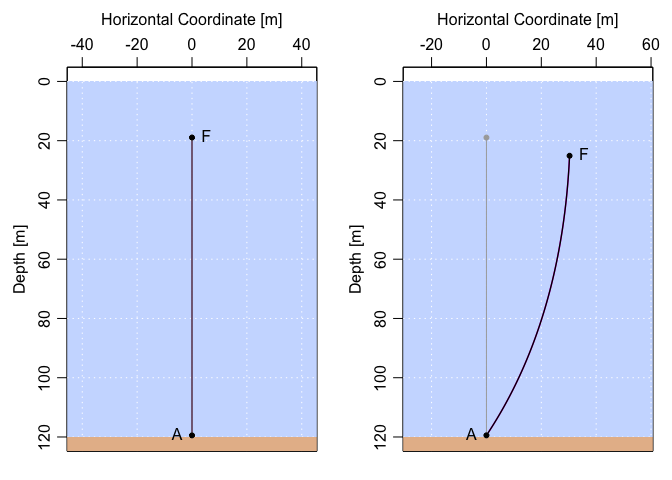

<!-- README.md is generated from README.Rmd. Please edit that file -->

# mooring

<!-- badges: start -->

[](https://github.com/dankelley/mooring/actions)

[](https://codecov.io/gh/dankelley/mooring?branch=main)
<!-- badges: end -->

The goal of mooring is to facilitate computations of the extent of
‘knockdown’ of oceanographic moorings caused by ocean currents.

## Installation

You can install the development version from
[GitHub](https://github.com/) with:

``` r
# install.packages("devtools")
devtools::install_github("dankelley/mooring")
```

## Example

This following shows how to assess the knockdown of a 20-inch float atop
100m of wire in a 0.5 m/s (roughly 1-knot) current. As an exercise, try
increasing the current to 1 m/s to see how much further the float gets
knocked down. Then try some other float types, using `float("?")` to get
a list of the types that are supported.

``` r
library(mooring)
# Design a mooring with a 20-inch float attached to a bottom anchor with 100m of wire cable.
m <- mooring(anchor(depth=120), wire(length=100), float("HMB 20"))
par(mfrow=c(1,2))
plot(m, fancy=TRUE)
# Discretise wire portion (to 1m spacing), then apply a 0.5 m/s current.
md <- discretise(m)
mdk <- knockdown(md, u=0.5)
plot(mdk, fancy=TRUE)
```


