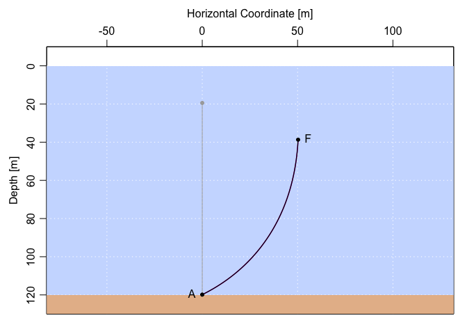

<!-- README.md is generated from README.Rmd. Please edit that file -->

# mooring

<!-- badges: start -->

[](https://github.com/dankelley/mooring/actions/workflows/R-CMD-check.yaml)

<!-- badges: end -->

The goal of mooring is to facilitate computations of the extent of
‘knockdown’ of oceanographic moorings caused by ocean currents.

## Installation

You can install the development version from
[GitHub](https://github.com/) with:

``` r
# install.packages("devtools")
devtools::install_github("dankelley/mooring")
```

## Example

The following shows how to assess the knockdown of a mooring consisting
of a bottom anchor, 100 m of wire, and a 20-inch diameter float, in a
region of water depth 120 m with a constant current of 0.5 m/s (roughly
1 knot). To learn more, (a) increse the current to 1 m/s and observe
changes in the mooring shape, (b) set the `which` argument of
`plot.mooring()`, to focus more directly on the knockdown, then (c)
explore the effects of specifying depth-dependent currents in the
`knockdown()` call.

``` r
library(mooring)
# Design a mooring with a 20-inch float attached to a bottom anchor with 100m of wire cable.
m <- mooring(anchor(depth=120), wire(length=100), float("HMB 20"))
# Discretise wire portion (to 1m spacing), then apply a 0.5 m/s current.
md <- discretise(m)
mdk <- knockdown(md, u=0.5)
par(mfrow=c(1, 2))
plot(md, fancy=TRUE)
plot(mdk, fancy=TRUE)
```


