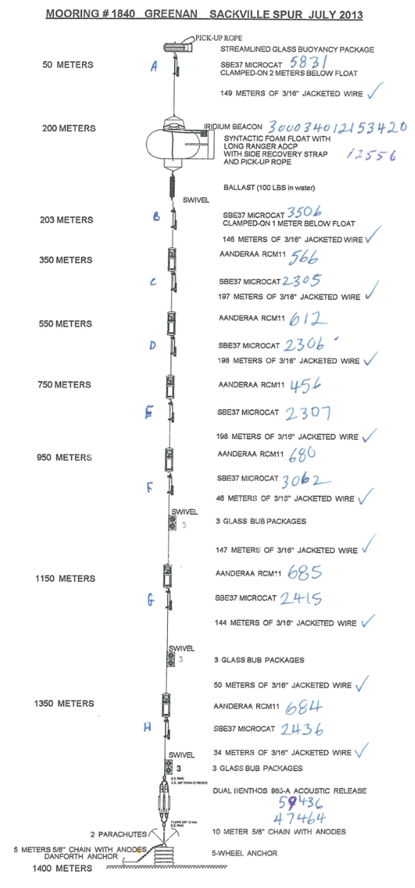

# Introduction

This shows a simulation of mooring 1840 on the Sackville Spur, based on a
diagram that appeared in a report provided by the Bedford Institute of
Oceanography (Department of Fisheries and Oceans, Canada) containing a Notice
to Mariners document.

# Source document

```{r,fig.cap="**Diagram for Bedford Institute of Oceanograph mooring 1840 on Sackville Spur**", out.width="70%", fig.align="center", echo=FALSE}

```

# Mooring construction

```{r}
# Mooring 1840 (p10 of doc)
library(mooring)

# Abbreviations for convenience
W <- function(length) wire("3/16in galvanized wire coated to 1/4in", length=length)
BUB3 <- float("streamlined BUB 3 Viny balls")
RCM11 <- instrument("RCM-11 in frame") # "AANDERAA RCM11"
microcat <- instrument("SBE37 microcat clamp-on style") # "SBE MICROCAT"

m <- mooring(anchor(depth=1400),
             chain("5/8in galvanized chain", length=10),
             release("benthos 965a release"),  # dual benthos 965-a
             BUB3,
             W(34),
             microcat,
             RCM11,
             W(50),
             BUB3,
             W(144),
             microcat,
             RCM11,
             W(147),
             BUB3,
             W(46),
             microcat,
             RCM11,
             W(198),
             microcat,
             RCM11,
             W(198),
             microcat,
             RCM11,
             W(197),
             microcat,
             RCM11,
             W(146),
             microcat,
             connector("swivel"),
             connector("ballast", -100/2.2, height=1, width=0.05, CD=1), # guess
             float("syn. float, bracket and 109lb ADCP"), # total guess; lots of choices
             W(149),
             microcat,
             float('new glass streamlined float c2'))
md <- discretise(m)
```


# Knockdown simulation

For illustration, this simulation uses an entirely made-up velocity structure.
```{r fig.cap="**Simulation of knockdown with a rough guess at current.**", fig.align="center", dev.args=list(pointsize=10)}
u <- function(depth) 0.5*exp(-depth/1000)
depth <- seq(m[[1]]$depth, 0, length.out=100)
layout(matrix(1:2,nrow=1),widths=c(0.7,0.3))
mdk <- knockdown(md, u=u)
plot(mdk, "knockdown", showDetails=TRUE, xlim=c(0, 15))
ylim <- par('usr')[3:4]
plot(mdk, "velocity")
```

# Details of mooring

The details of the mooring are revealed with

```{r}
print(m)
```

