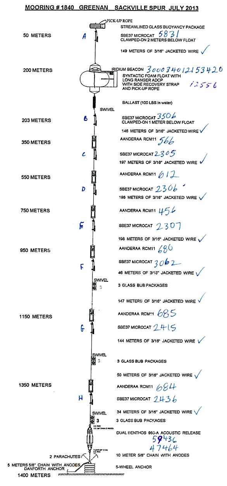

# Introduction

This vignette explains how to use the `mooring` package to create a simulation
of mooring 1840 on the Sackville Spur, based on a diagram that appeared in a
report provided by the Bedford Institute of Oceanography (Department of
Fisheries and Oceans, Canada) containing a Notice to Mariners document.

# Source Document

```{r,fig.cap="**Diagram for Bedford Institute of Oceanograph mooring 1840 on Sackville Spur**", out.width="70%", fig.align="center", echo=FALSE}

```

# Mooring Construction

```{r}
# Mooring 1840 (p10 of doc)
library(mooring)

# Abbreviations for convenience
W <- function(length) wire("3/16in galvanized wire coated to 1/4in", length=length)
BUB3 <- float("streamlined BUB 3 Viny balls")
RCM11 <- instrument("RCM-11 in frame") # "AANDERAA RCM11"
microcat <- instrument("SBE37 microcat clamp-on style") # "SBE MICROCAT"

m <- mooring(anchor(depth=1400),
             chain("5/8in galvanized chain", length=10),
             release("benthos 965a release"),  # dual benthos 965-a
             BUB3,
             W(34),
             microcat,
             RCM11,
             W(50),
             BUB3,
             W(144),
             microcat,
             RCM11,
             W(147),
             BUB3,
             W(46),
             microcat,
             RCM11,
             W(198),
             microcat,
             RCM11,
             W(198),
             microcat,
             RCM11,
             W(197),
             microcat,
             RCM11,
             W(146),
             microcat,
             connector("swivel"),
             connector("ballast", -100/2.2, height=1, width=0.05, CD=1),
             float("syn. float, bracket and 109lb ADCP"),
             W(149),
             microcat,
             float('new glass streamlined float c2'))
md <- discretise(m)
```

# Knockdown Simulation

For illustration, this simulation uses an entirely made-up velocity structure.
```{r, fig.cap="**Simulation of knockdown with a depth-decaying current.**", fig.align="center", out.width="100%", dev.args=list(pointsize=9)}
u <- function(depth) 0.5*exp(-depth/1000)
depth <- seq(tail(depth(m), 1), 0, length.out=100)
layout(matrix(1:2,nrow=1), widths=c(0.75,0.25))
mdk <- knockdown(md, u=u)
plot(mdk, "knockdown", xlim=c(0, 40), showDetails=TRUE)
plot(mdk, "velocity")
```
Note that the limit set on the first plot sets aside enough space for the
labels (and establishes a common scale used in a later exercise).

# Knockdown-Speed Diagram

We may get an idea of the overall response of the mooring to water velocity by
running simulations with a range of velocities.  Noting that the top of the
mooring, from the surface to 200m, is knocked over much more than the rest,
let's focus on the depth of the second microcat from the top, i.e. the one
below the ADCP.  Typing `md` in a console gives an overview, from which one may
see that the second microcat from the top, i.e. the one below the ADCP, is
element 155, i.e.
```{r}
md[[155]]
```
Similarly, the ADCP is
```{r}
md[[152]]
```

We may use this to construct a diagnostic curve giving an overview of the
mooring knockdown, as follows. Note that the $x$ axis of the resultant plot is
showing velocity at the depth of the ADCP.
```{r fig.cap="**Speed-knockdown summary diagram**", out.width="100%", fig.align="center", dev.args=list(pointsize=9)}
par(mar=c(3,3,1,1), mgp=c(2,0.7,0), mfrow=c(1,1))
iADCP <- 152
imicrocat <- 155
N <- 50
u0 <- seq(0, 0.5, length.out=N)
dz <- rep(NA, N)
U <- rep(NA, N)
for (i in seq_len(N)) {
    u <- function(depth) u0[i] * exp(-depth/1000)
    k <- knockdown(md, u)
    U[i] <- u(-k[[iADCP]]$z)
    dz[i] <- k[[imicrocat]]$z - md[[imicrocat]]$z
}
plot(U, dz, lwd=2, type="l", xlab="Velocity [m/s]", ylab="Knockdown [m]")
grid()
mtext(sprintf("Knockdown of microcat #2, near %.0f m depth", -md[[imicrocat]]$z))
```
```{r eval=FALSE, echo=FALSE}
curve <- list(U=U, dz=dz)
save(curve=curve, file="velocity_knockdown_prediction.rda")
```


# Examining Moorings

## Overview

An overview of a mooring is provided by printing it, either with
```{r eval=FALSE}
print(m)
```
or, in an interactive session, with
```{r eval=FALSE}
m
```
For the mooring constructed above, the results are as follows.
```{r echo=FALSE}
m
```
The number at the start is the component number (see next section).

Note that the results for `md` will be similar, except there will be many more
elements (for the segmented chain and wire components).  If `mdk` is examined
in this way, the $x$ and $z$ values will be different.

## Components

To learn more about, say, the second element (the chain from anchor to acoustic
release), use

```{r}
m[[2]]
```
and to see the full details, use
```{r}
dput(m[[2]])
```
or, with less detail but in a more digestible format,
```{r}
str(m[[2]])
```

You may go further with e.g.
```{r}
m[[2]]$width
```

**Exercise 1.** Double the chain density, to see the effect on knock-down.

**Exercise 2.** Double the drag coefficient on the wire, to see how much this
increases knockdown.


## Answers to Exercises

### 1. Doubling chain density

A simple way to do this is to create `m` as before, but then to use
```{r}
m[[2]]$buoyancyPerMeter <- 2 * m[[2]]$buoyancyPerMeter
```
before using `digitise()`, `knockdown()` and then `plot.mooring()`.  Before
doing that though, you should ask yourself whether you expect to see a large
effect.

### 2. Doubling wire drag

One way to do this is to replace the `W` definition with
```{r}
W <- function(length) {
    w0 <- wire("3/16in galvanized wire coated to 1/4in", length=1)
    wire("draggy wire", buoyancyPerMeter=w0$buoyancyPerMeter,
         diameter=w0$diameter, CD=2*w0$CD, length=length)
}
```
and then create `m`, `md` and `mdk` as before. The results are as follows. Note
that knockdown is approximately doubled.  This makes determination of drag
coefficient an especially important factor in mooring design; see e.g.
@hamilton_validation_1989 and @hamilton_mooring_1997.

```{r, echo=FALSE, fig.cap="**Simulation with doubled wire drag.**", fig.align="center", out.width="100%", dev.args=list(pointsize=9)}
u <- function(depth) 0.5*exp(-depth/1000)
mDraggy <- mooring(anchor(depth=1400),
                   chain("5/8in galvanized chain", length=10),
                   release("benthos 965a release"),  # dual benthos 965-a
                   BUB3,
                   W(34),
                   microcat,
                   RCM11,
                   W(50),
                   BUB3,
                   W(144),
                   microcat,
                   RCM11,
                   W(147),
                   BUB3,
                   W(46),
                   microcat,
                   RCM11,
                   W(198),
                   microcat,
                   RCM11,
                   W(198),
                   microcat,
                   RCM11,
                   W(197),
                   microcat,
                   RCM11,
                   W(146),
                   microcat,
                   connector("swivel"),
                   connector("ballast", -100/2.2, height=1, width=0.05, CD=1),
                   float("syn. float, bracket and 109lb ADCP"),
                   W(149),
                   microcat,
                   float('new glass streamlined float c2'))
mdDraggy <- discretise(mDraggy)
layout(matrix(1:2,nrow=1), widths=c(0.75,0.25))
mdkDraggy <- knockdown(mdDraggy, u=u)
plot(mdkDraggy, "knockdown", xlim=c(0, 40), showDetails=TRUE)
plot(mdkDraggy, "velocity")
```

# References

