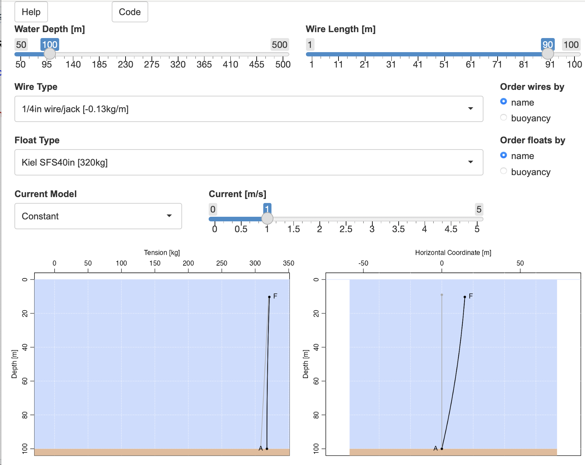

# Introduction

The `mooring` package deals with oceanographic moorings and their deformation
by horizontal currents. The theory for that deformation is laid out in the
vignetted entitled *Mooring Response to Unidirectional Flow*, while the present
vignette deals with using the package.

# Mooring Construction

Moorings are constructed with `mooring()`, the arguments of which, called
'elemental` objects, are created by `anchor()`, `chain()`, `float()`,
`instrument()`, `release()`, or `wire()`.  These are specified from bottom to
top.  For example, consider a mooring in water of depth 200m, with a 150-m long wire
connecting a bottom anchor to a float.  This could be created with
```{r}
library(mooring)
m <- mooring(anchor(depth=200), wire(length=150), float())
```
where each of the function calls that construct the arguments has taken on a
default value.  To learn the possible values for any of these, supply a first
argument as the string `"?"`, e.g. the possible wire types (which include
non-metallic wires) is:
```{r}
wire("?")
```

More details on the functions are provided with e.g. `?wire`.  Details of the
objects are provided in the vignette called *Default Values for Mooring
Elements*.  Each element has information that the package can use to find
forces that control mooring shape.  The horizontal drag force at a given water
speed depends on the object's frontal area and drag coefficient.  The vertical
buoyancy force depends on the buoyancy of the element, which is expressed (in
kg) mass equivalents (assuming $g=9.8$m/s$^2$ for the acceleration of gravity)
for discrete elements such as floats and instruments, and in buoyancy per
length (in kg/m) for wires.

Note that new types of wire, float, etc. can be created easily, by supplying a name
that is not matched in the list of built-in values. The help pages for the
various functions explain what must be specified.

Actual moorings are likely to have multiple instruments, along with multiple
buoyancy elements, but the mooring just created is sufficient to continue the
discussion here.

**Exercise 1: Produce a table of float name and buoyancy.**

**Exercise 2: Plot float drag vs buoyancy, and compare with expectations.**

# Knockdown Computation

The `knockdown()` function is used to compute the shape of a mooring that is
deformed by a horizontal current.  It takes just two arguments: the mooring,
and the velocity. The latter may be a fixed value (in m/s), or a function that
gives velocity as a function of depth below the water surface.

But, before applying `knockdown()`, it is important to first subdivide any
`wire` elements into smaller lengths, so that `knockdown()` can compute the
shape more precisely.  This is done with the `discretise()` function.  The
following shows how to do this with the mooring just created.
```{r}
md <- discretise(m) # breaks wire portions into approx. 1-m segments
```
and the knocked-down mooring is found with e.g.
```{r}
mdk <- knockdown(md, u=1)
```
for a 1 m/s current.

The functions `x()` and `z()` find the $x$ and $z$ locations of mooring
elements.  Note that $z=0$ at the surface and negative in the water column; use
`depth()` to get depth below the surface.

For example, the shape of the knocked-over mooring from the previous code
block could be plotted with
```{r, fig.cap="**Mooring shape (not to scale).**", fig.align="center"}
plot(x(mdk), z(mdk), type="l")
```

Similarly, the tension between elements is found with `tension()`, and the angle that elements make to the vertical is found with `angle()`.

# Plotting

The plot shown above is quite primitive, so the package offers a `plot()`
function.  For example, this gives a view of tension and shape.
```{r, fig.cap="**Tension and shape diagrams created with plot() from mooring package.**", fig.align="center"}
par(mfrow=c(1, 2))
plot(mdk, which="tension")
plot(mdk, which="shape")
```

In both instances, the gray line is the shape that would occur with no current.
Note that the shape plot uses a 1:1 aspect ratio, making it easier to
understand the result.  Also, note that depth is plotted here, as opposed to
the $z$ shown above.

A fancier version is obtained with
```{r, fig.cap="**Tension and shape, with water coloured blue and bottom coloured brown.**", fig.align="center"}
par(mfrow=c(1, 2))
plot(mdk, which="tension", fancy=TRUE)
plot(mdk, which="shape", fancy=TRUE)
```

# Interactive App

The package supplies `app()` as a convenient way to learn about the package.
By design, it does not offer a way to make complex moorings.  For example, it
only provides an anchor-wire-float mooring, with no way (yet) to add a bottom
release, instruments, floats, etc.

The following is a screenshot of the case studied so far, but with a weaker
surface mooring (a 20-inch diameter Hydro-float Mooring
Buoy^[https://deepwaterbuoyancy.com/wp-content/uploads/hydro-float-mooring-buoys-deepwater-buoyancy.pdf]).
The knockdown is much higher than seen in the plots above, because the float
buoyancy is less than for that of the default float.  (As a guide, the menus of
app display the buoyancies of wire and float elements.)

```{r,fig.cap="**Snapshot of the app() GUI application.**", out.width="100%", fig.align="center", echo=FALSE}

```

# Advanced Usage


## Creating New Elements

If the first argument to an element-forming function such as `float()`,
`instrument()`, `wire()`, `instrument()`, etc., is not in the list of built-in
types, then a new object is created.  In this situation, all of the other
arguments to the function must be supplied, and it should be born in mind that
those arguments vary from type to type. For example,
```{r}
i <- instrument("myNewInstrument", buoyancy=-5, height=1, area=0.1, CD=1)
```
creates a new instrument object for something that has buoyancy -5kg (meaning
it weighs 5kg in seawater), height 1m, area 0.1\eqn{m^2}, and drag coefficient
1.

## Altering Existing Elements

Strumming of wires in currents can increase wire drag coefficient $C_D$ by
perhaps a factor of 2 [@hamilton_mooring_1997;@hamilton_validation_1989], and
simple way to account for that might be to use
```{r}
w <- wire(length=100) # default wire type
w2 <- w
w2$CD <- 2 * w2$CD
```
As a check, we may confirm that this doubles the drag for, say, a 1m/s current:
```{r}
c(drag(w, 1), drag(w2, 1))
```

All object types store a value for `CD`, but the other entries depend on the
type. The simplest way to find out what is store in a given type is to create
a sample object and study it, e.g. with
```{r}
str(float())
```

## Mooring Design

A prime question in the design of a mooring is the amount of buoyancy that will
be required to maintain an essentially upright position, despite the tendency
of currents to knock it over.  The `mooring` package can offer guidance in this
task.

As a simplified example, imagine that a mooring is to be placed in 1 km of
water, with a 1/4-inch jacketed wire cable connecting a subsurface float to a
bottom anchor. How much buoyancy will be required to hold this mooring
acceptably upright?  To answer this, we may do as follows.

```{r fig.cap="**Dependence of knockdown on current.**", fig.align="center"}
library(mooring)
a <- anchor(depth=1000)
w <- wire(length=900)
f <- float()
m <- mooring(a, w, f)
us <- seq(0, 1.0, length.out=25)
md <- discretise(m)
depths <- sapply(us, function(u)
                 {
                     mdk <- knockdown(md, u)
                     depth(tail(mdk,1))
                 })
par(mar=c(3,3,1,1), mgp=c(2,0.7,0))
plot(us, depths, ylim=rev(range(depths)), type="l", pch=20, cex=0.5,
     xlab="Horiz. velo. [m/s]", ylab="Float depth [m]")
grid()
abline(h=100*c(1, 1.1), col=c(4,2))
```

The blue and red horizontal lines indicate zero knockdown (for zero current)
and 10 percent knockdown, respectively. The diagram suggests that if a 10 depth
increase is taken as a design limit, that this float will be sufficient up to
speeds of approximately $0.3$m/s.

**Exercise 3: Find a float that will hold this mooring taut in 2m/s current.**


# Solutions to Exercises

## Exercise 1

A table of float name and buoyancy is produced with
```{r}
f <- float("?") # get list of floats
b <- unlist(lapply(f, function(x) buoyancy(float(x))))
df <- data.frame(float=f, buoyancy=b)
```
and the 4 least-buoyancy entries are
```{r}
o <- order(df$b)
df[o[1:4], ]
```
(Note that not all entries in this table are subsurface floats!)

## Exercise 2

We do this in three steps (see comments in the code).

1. Create a data frame of floats with non-zero buoyancy and non-zero drag.
   (The latter occurs for some floats that have insufficient information for
   the drag computation.)
2. Display on a log-log plot, with buoyancy, which is reported in kg, being
   converted to Newtons by multiplying by $g=9.8$m/s$^2$.
3. Assuming that floats have similar constitution, and spherical shape, then
   buoyancy should scale as the cube of radius and drag to the square of
   radius.  On this log-log plot, therefore, the data ought to lie along a line
   of slope 2/3.

```{r, fig.cap="**Float drag-buoyancy relationship.**", fig.align="center"}
# 1
f <- float("?") # get list of floats
b <- unlist(lapply(f, function(x) buoyancy(float(x))))
d <- unlist(lapply(f, function(x) drag(float(x), 1)))
ok <- b>0 & d>0
df <- data.frame(float=f[ok], drag=d[ok], buoyancy=b[ok])
# 2
plot(df$buoyancy*9.8, df$drag, xlab="Drag [N]", ylab="Buoyancy [kg]", log="xy")
# 3
abline(0, 2/3)
```

From the plot, it appears that there is at least some merit to the assumptions
outlined.

This sort of analysis can be useful in building intuition.  Note that larger
floats have higher drag than small ones, which would seem to increase
knockdown, but they also have *much* larger buoyancy.  This is why large floats
are needed for taut moorings in high-current areas, or, of course, to suspend
long mooring lines.

## Exercise 3

To find a float that will hold this mooring taut in 2m/s current, one approach
is to use `app()`, which has a pulldown menu for the float type.  Another
approach is to start with the table produced in Exercise 1, and try different
float models in the code given in the "Mooring Design" section.

Exploration along these lines reveals that
```{r}
f <- float("CDMS 2m sphere")
```
will suffice, as its buoyancy, `r float("CDMS 2m sphere")$buoyancy` kg,
sufficiently exceeds the `r float()$buoyancy` kg of the default float.

# References

